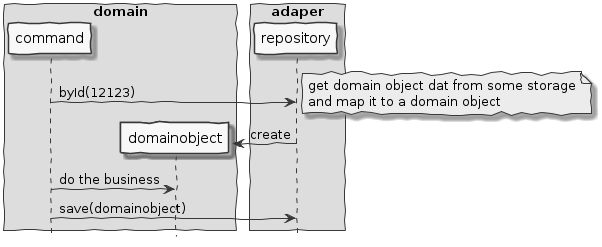
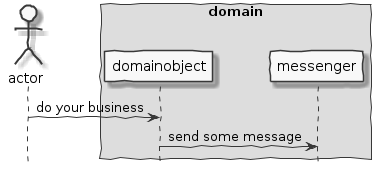
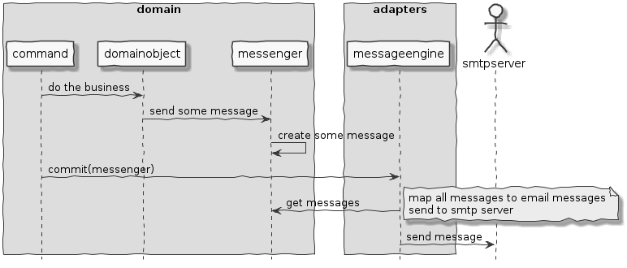
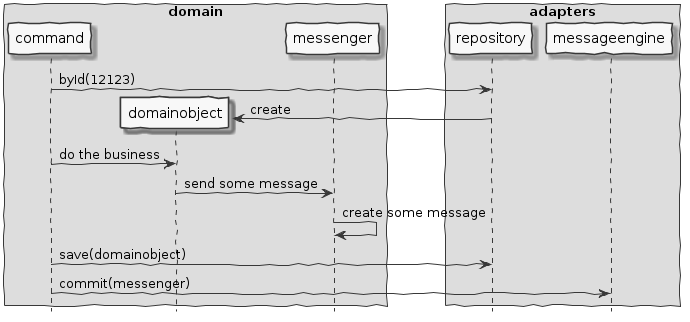

## Design considerations

### Hexagons
We use hexagonal architecture for our applications to separate business logic
from integrations with the outside world. Typically our applications use command
and query separation (at least conceptually), and we tend to model commands (and queries) explicitly as classes.

A command coordinates command execution. It typically uses repositories to fetch domain object, delegate some behaviour to it, saves the result in a repository and responds to its caller. You may think of this as: We separate the domain logic from integrating with the outside world and the command coordinates the split.

<!--
@startuml command-execution
skinparam {
  handwritten true
  monochrome true
}
hide footbox
box "domain"
participant command order 10
participant domainobject order 20
end box
box "adaper"
participant repository order 30
end box
command -> repository: byId(12123)
note right
get domain object dat from some storage
and map it to a domain object
end note
create domainobject
repository -> domainobject: create
command -> domainobject: do the business
command -> repository: save(domainobject)
@enduml
-->

### Sending messages

If the business logic (as modelled in the domain object) needs to notify someone or something of something (i.e. send a message) we want to model that in an how-to-send-a-message-agnostic manner. 
The domain object should then be able to say to a messenger concept: 'send some message'
<!--
@startuml domain-messenger-interaction
skinparam {
  handwritten true
  monochrome true
}
hide footbox
actor actor
box "domain"
actor -> domainobject: do your business
domainobject -> messenger: send some message
end box
@enduml
-->

This makes 'sending' messages in the domain object(s) easy to test and focused on what messages, with what content are sent in what situation. Testing all of this logic integrated with some external (SMTP?) server would be a pain.

### Integrating with SMTP

We'd like all integrations with the outside world to be in a controlled place; an adapter. Adapter integration tests would test that interaction regardless of the exact content of messages. Therefore we decided to separate the creating and collecting the messages from actually sending it, coordinated by the command.

<!--
@startuml command-execution-with-message
skinparam {
  handwritten true
  monochrome true
}
hide footbox
box "adapters"
participant messageengine order 30
end box
box "domain"
participant command order 10
participant domainobject order 20
participant messenger order 20
end box
actor smtpserver order 40
command -> domainobject: do the business
domainobject -> messenger: send some message
messenger -> messenger: create some message  
command -> messageengine: commit(messenger)
messageengine -> messenger: get messages
note right
map all messages to email messages
send to smtp server
end note
messageengine -> smtpserver: send message
@enduml
-->

### Integrating it with the command repository approach

From the perspective of a coordinating command, a complete sequenc of events from getting a domain object to saving the result and sending potential messages could look like:

<!--
@startuml command-execution-with-repo-and-message
skinparam {
  handwritten true
  monochrome true
}
hide footbox
box "adapters"
participant repository order 30
participant messageengine order 30
end box
box "domain"
participant command order 10
participant domainobject order 20
participant messenger order 20
end box
command -> repository: byId(12123)
create domainobject
repository -> domainobject: create
command -> domainobject: do the business
domainobject -> messenger: send some message
messenger -> messenger: create some message  
command -> repository: save(domainobject)
command -> messageengine: commit(messenger)
@enduml
-->

[back to readme](https://github.com/qwaneu/quiltz-messaging)